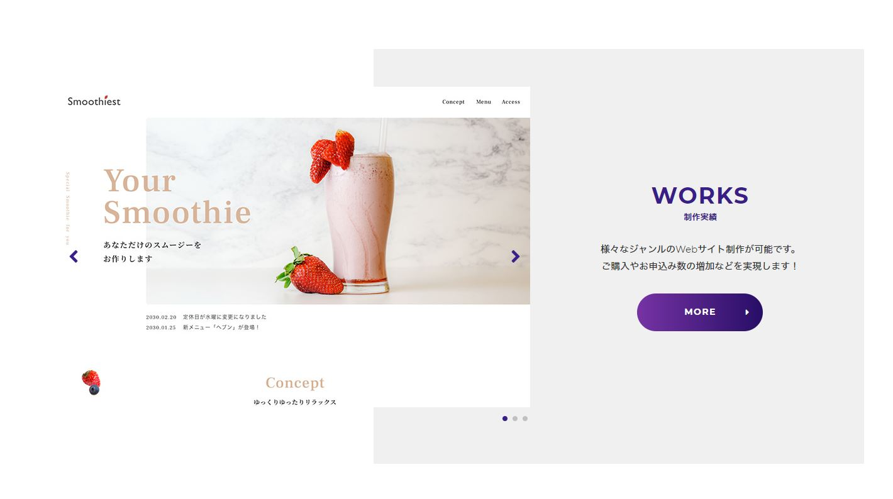

# 模写コーディング   

## 下記のURLのサイトの模写です。   
Markdown: [PON DESIGN](https://pon-design.netlify.app/)   

### 手順   
* デザインカンプからhtmlファイルを作成してコーディングを行ってください。   
* デザインカンプはweb/design/sample.xdファイルになります。   
* レスポンシブ対応を心がける。   
* jsは付けられる範囲で問題ないです。   
* 下記の画像の様な写真をスライドショーのようにみせるカルーセルの実装ではCSSフレームワークのBootstrap(今後のコーディング案件でも使う機会が増えてくると思うので練習がてら色々試してみるのもいいかと思います。)を使用すると簡単に実装できます。カルーセルの実装では、サイズの調整とカルーセルがキチンと作動してあれば問題ありませんが、余力があれば色合いや遷移のエフェクトなどを模写サイトと同様にしてみてください。また、Bootstrapを使用せずに自身でJQuery等を使っていただいても構いません。   
Markdown: [Bootstrap](https://getbootstrap.jp/docs/5.0/components/carousel/)   

* サイト模写で使用する画像はimgフォルダー内に全て用意しています。   
* またCSSはcssフォルダー内に随時作成していってください。   
* またディレクトリ構成は変更しても頂いて構いません。   
* 一日の終わりにgitに上げユーザー名`uepricky`に対してプルリクエストを出してください。   
* 完成していない場合はプルリクエスト作成時タイトルの先頭に`WIP:`の文字を付けるとプルされなくなります。   
> 完成していなくても一日の終わりにgitに上げてください。   
* 模写終了後は、タイトルの`WIP:` を削除して`uepricky`に対してプルリクエストを出してください。   
* またレスポンシブ対応しているのであればデザインをアレンジしてもらっても構いません。   
* 制作にあたり参考になるサイトURLはrefference/refference.txtにあります。